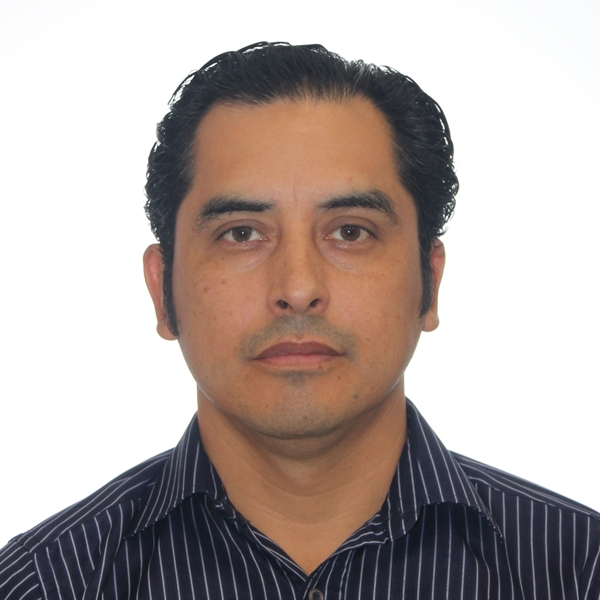

🛠️ Systems Engineer: 🗣️ Quality Assurance: Senior Test Analyst

| [Contact me](mailto:rozumba@outlook.com.au) | [Follow me on LinkedIn](https://www.linkedin.com/in/rozumba){:target="\_blank"} | [Portfolio](https://github.com/na001988?tab=repositories){:target="\_blank"}

### Personal Statement

I possess strong self-motivation and exceptional skills, capable of thriving in both independent and collaborative team environments to achieve successful results. 
With a talent for problem-solving, I excel in resolving IT issues and am continuously seeking ways to improve processes by incorporating advanced technologies and innovative work approaches.

### Achievements

• 📈 ?

• 🙋‍♂️ ?

• 🛠️ ?

• 👁️ ?

[Work Experience](/experience/README.MD)

### Certifications
- [Dynatrace Associate](https://www.credly.com/badges/5461b72b-82ec-4fec-b779-35eb078f5ceb/linked_in?t=s0sy54){:target="\_blank"} 
- [Microsoft - Github Actions](https://learn.microsoft.com/en-gb/training/achievements/learn.github.github-actions-automate-tasks.badge?username=AlejandroSG-3988&sharingId=7539A66B782C7D61){:target="\_blank"}

### Interest

?
